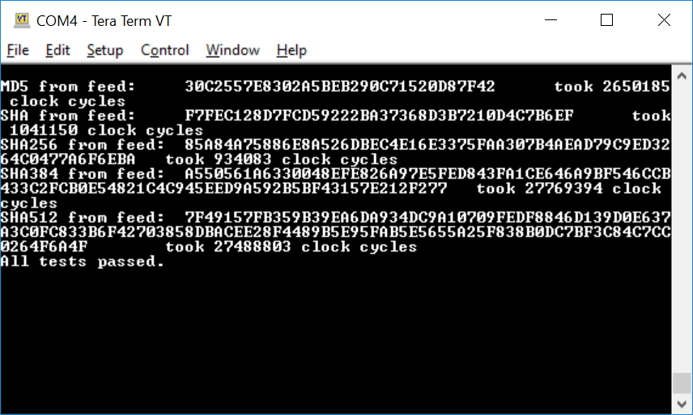

# Introduction
The following demonstration describes the large hash functionality of the crypto module.
# Description
This application demonstrates how to execute hashes on large blocks of data. In this case, the demonstration performs MD5,
SHA-1, SHA-256, SHA-384, and SHA-512 hashing on a 512 * 1024 block of the letter 'a'.
After the hashing has been performed, the application outputs via the system console the results of the hashing, and the time it
took to perform each form. It then compares the generated hashes with known values for each algorithm. If all tests pass a
message is presented through the system console. If any tests fail a corresponding message is presented through the system
console.

# Building the Application
To build this project, the project corresponding to the functionality desired must be opened in MPLAB X IDE or the IAR IDE. The following tables list and describe the project and supported configurations. The parent folder for these files is crypto/apps/large_hash/firmware.

## MPLAB X IDE Projects
This table lists the name and location of the MPLAB X IDE project folder for the demonstration.

| Project Name | BSP Used | Description |
| --- | --- | ---|
| sam_e70_xplained_ultra.X | sam_e70_xplained_ultra | Large Hash project using the SAME70 and hardware accelerated cryptography|
| sam_e70_xplained_ultra_rtos.X | sam_e70_xplained_ultra | Large Hash project using the SAME70 and hardware accelerated cryptography. The software has been enabled to use freeRTOS.|
| sam_e70_xplained_ultra_sw.X | sam_e70_xplained_ultra | Large Hash project using the SAME70 and software cryptography|
| sam_e54_xplained_pro_sw.X | sam_e54_xplained_pro | Large Hash project using the SAME54 and software cryptography|
| sam_e54_xplained_pro.X | sam_e54_xplained_pro | Large Hash project using the SAME54 and hardware cryptography|
| sam_e54_xplained_pro_rtos.X | sam_e54_xplained_pro | Large Hash project using the SAME54 and hardware cryptography. The software has been enabled to use freeRTOS.|
| pic32mz_ef_sk_sw.X | pic32mz_ef_sk | Large Hash project using the PIC32MZ-EF and software cryptography|
| pic32mz_ef_sk.X | pic32mz_ef_sk | Large Hash project using the PIC32MZ-EF and hardware cryptography|
| pic32mz_ef_sk_rtos.X | pic32mz_ef_sk | Large Hash project using the PIC32MZ-EF and hardware cryptography. The software has been enabled to use freeRTOS.|
| pic32mz_w1_curiosity_sw.X | pic32mz_w1 | Large Hash project using the PIC32MZ-W1 and software cryptography|
| pic32mz_w1_curiosity.X | pic32mz_w1 | Large Hash project using the PIC32MZ-W1 and hardware cryptography|
| pic32mz_w1_curiosity_rtos.X | pic32mz_w1 | Large Hash project using the PIC32MZ-W1 and hardware cryptography. The software has been enabled to use freeRTOS.|
| sam_l11_xplained_pro_sw.X | sam_l11_xplained_pro | Large Hash project using the SAML11 and software cryptography|
| sam_l11_xplained_pro_hw.X | sam_l11_xplained_pro | Large Hash project using the SAML11 and hardware cryptography|

The application is built by using the standard MPLAB X IDE buttons.

## IAR IDE Projects
| Project Name | BSP Used | Description |
| --- | --- | ---|
| sam_a5d2_xplained_ultra_sw.IAR | SAM A5D2 Xplained Ultra | Large Hash project using the SAMA5D2 and software cryptography |
| sam_a5d2_xplained_ultra.IAR | SAM A5D2 Xplained Ultra | Large Hash project using the SAMA5D2 and hardware cryptography |
| sam_a5d2_xplained_ultra_rtos.IAR | SAM A5D2 Xplained Ultra | Large Hash project using the SAMA5D2 and hardware cryptography. The software has been enabled to use freeRTOS. |
| sam_9x50_ek_sw.IAR | SAM 9x60 EK | Large Hash project using the SAM9X60 and software cryptography |
| sam_9x50_ek.IAR | SAM 9x60 EK | Large Hash project using the SAM9X60 and hardware cryptography |
| sam_9x50_ek_rtos.IAR | SAM 9x60 EK | Large Hash project using the SAM9X60 and hardware cryptography. The software has been enabled to use freeRTOS. |

1. Once the project is loaded, click on Project in the Main Toolbar.
2. Click on Make under the Project menu to build the demo. 

# Configuring the Hardware
Refer to the following pages to configure the hardware:
* [SAM E70 Xplained Ultra](../docs/Configuring-the-SAM-E70-Xplained-Ultra-Board.md)
* [SAM E54 Xplained Pro](../docs/Configuring-the-SAM-E54-Xplained-Pro-Board)
* [SAM A5D2 Xplained Ultra](../docs/Configuring-the-SAM-A5D2-Xplained-Ultra-Board)
* [PIC32MZ EF Starter Kit](../docs/Configuring-the-PIC32MZ-EF-Starter-Kit)
* [SAM L21 Xplained Pro](../docs/Configuring-the-SAM-L21-Xplained-Pro-Board)
* [SAM 9x60 EK](../docs/Configuring-the-SAM-9X60-EK-Board)
* [SAM L11 Xplained pro](../docs/Configuring-the-SAM-L11-Xplained-Pro-Board.md)

# Running the Demostration
1. First connect the board to the PC as described in the 'Configuring the Hardware' section.
2. Configure a terminal application (ex. Tera Term) to access the newly attached serial port. The parameters to use:
	* 115,200 bps
	* 8 data bits
	* no parity
	* 1 stop bit
	* no flow control
3. Compile the demostration
	* For MPLAB X
		1. Use the standard MPLAB X IDE Buttons
	* For IAR
		1. Once the build is completed, in an explorer window, go to ...\crypto\apps\encrypt_decrypt\firmware\sam_a5d2_xplained_ultra_sw.IAR\Debug\Exe
		2. Copy the harmony.bin file onto an SD card
		3. Copy the boot.bin file onto the SD card from [here](https://github.com/Microchip-MPLAB-Harmony/at91bootstrap/blob/master/boot.bin)
		4. Insert the SD card into the card connector on the SAMA5D2 board.
		5. Press the reset button on the board
4. Observe the output from the serial console. An example is shown in the following figure.  Each project will have different timing results.

